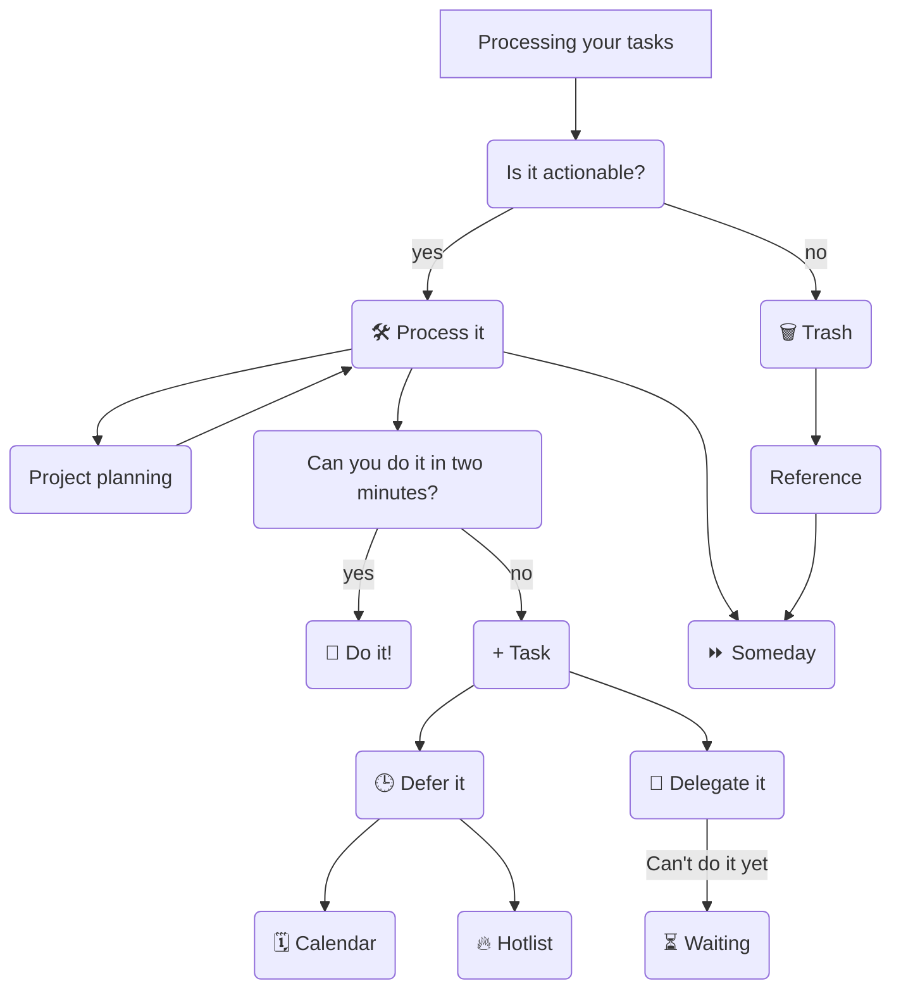

# GDT with mermaid

The famous diagram from the book "[Getting Things Done](https://en.wikipedia.org/wiki/Getting_Things_Done)" - implemented with markdown of mermaid.js

```mermaid
flowchart TD
    A[Processing your tasks] --> B(Is it actionable?)
    B --> |yes| F("🛠 Process it")
    F --> G(Project planning)
    G --> F
    F --> H(Can you do it in two minutes?)
    H --> |yes| I("💪 Do it!")
    H --> |no| J("+ Task")
    J --> K("🕒 Defer it")
    K --> N("🗓 Calendar")
    K --> O("🔥 Hotlist")
    J --> L("👥 Delegate it")
    L --> |Can't do it yet| M("⏳ Waiting")
    F --> E    
    B --> |no| C("🗑 Trash")
    C --> D(Reference)
    D --> E("⏩ Someday")
    
```
